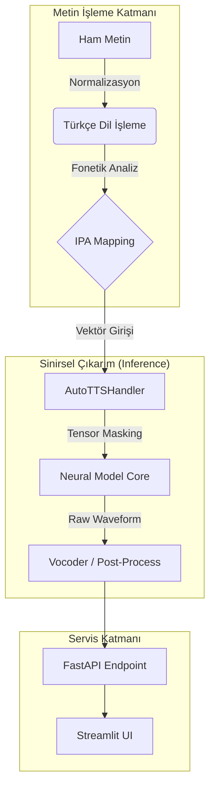

# 🎙️ TTS-Arena: Ses Modelleri Kıyaslama Arenası

<div align="center">
    
 
 
 
 


</div>

---

## 🚀 Proje Özeti

**TTS-Arena**, Türkçe dil desteğine odaklanan, açık kaynaklı Metinden Sese modellerini endüstriyel standartlarda kıyaslamak için geliştirilmiş ileri seviye bir yapay zeka arenasıdır. Proje, özellikle kurumsal terminoloji ve karmaşık dil yapıları üzerinde yüksek doğruluklu ses sentezi sağlamak amacıyla modüler bir mimari ile tasarlanmıştır.

### 🌟 Temel Özellikler

* **Modüler Model Orkestrasyonu:** Yeni modellerin sisteme zahmetsizce entegre edilmesini sağlayan `Handler` ve `Service` yapısı.
* **Gelişmiş Metin Normalizasyonu:** Türkçe fonetik kuralları, sayısal değerler ve kısaltmalar üzerinde ileri seviye ön işleme.
* **Dinamik Tensör Yönetimi:** Sinirsel ağlardaki maskeleme ve boyut hatalarını çekirdek seviyesinde çözen hata bastırma mekanizması.
* **İnteraktif Analiz Paneli:** Sadece tek bir modeli değil birden fazla modeli aynı anda test etme kabileyeti.

---

## 🛠️ Sistem Mimarisi

TTS-Arena, metin girişinden ses dalgasına kadar uçtan uca yüksek performanslı bir boru hattı sunar.

### 1. Veri ve İşlem Akışı



---


### 🐳 Docker ile Hızlı Kurulum

Projeyi izole ve optimize edilmiş bir konteyner ortamında başlatmak için:

```bash
docker-compose build --parallel
docker-compose up -d

```

## 🤝 İletişim

Sistem mimarisi veya model entegrasyonu ile ilgili sorularınız için GitHub Issues üzerinden iletişime geçebilirsiniz.

---

<div align="center">
<sub>Türkçe Ses Teknolojilerinin Geleceği İçin Geliştirildi. ❤️</sub>
</div>

---
